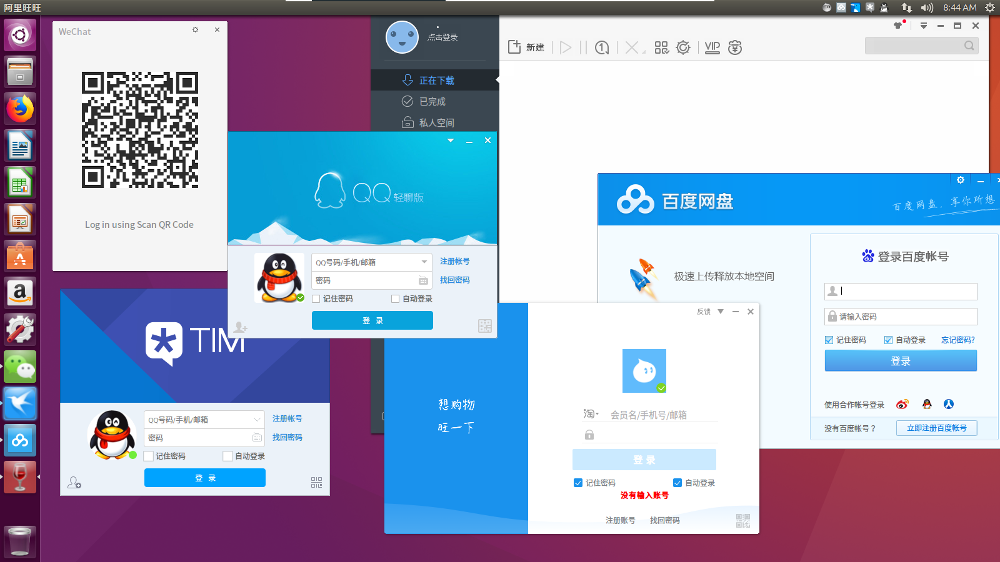

# Tutorial to install apps packaged by Deepin
This repo shows how to install apps packaged with deepin-wine by [Deepin](https://en.wikipedia.org/wiki/Deepin) on Ubuntu based linux distributions, like Wechat, QQ, TIM, Thunder Speed etc.



## Clone repo to local
```sh
git clone https://github.com/Jactor-Sue/Deepin-Apps-Installation.git
```
## Installation
### Install `deepin-wine`
```sh
chmod +x ./install-deepin-wine.sh && ./install-deepin-wine.sh
```
### Install apps packaged by Deepin
There are several apps under `deepin-apps` directory, choose what you want.
```sh
cd ./deepin-apps
sudo dpkg -i xxx.deb
```

The package name corresponding to app's listed bellow.

Package name|App name
-|-
deepin.com.baidu.pan_5.5.4deepin8_i386.deb|BaiduNetdisk
deepin.com.qq.im_8.9.19983deepin20_i386.deb|QQ
deepin.com.qq.im.light_7.9.14308deepin8_i386.deb|QQLight
deepin.com.qq.office_2.0.0deepin1_i386.deb|TIM
deepin.com.taobao.wangwang_9.11.02Cdeepin0_i386.deb|AliWangWang
deepin.com.thunderspeed_7.10.35.366deepin17_i386.deb|ThunderSpeed
deepin.com.wechat_2.6.2.31deepin0_i386.deb|Wechat

After that you can find apps in launcher.

>**Note：** It may be failed after installation, try it several times or reboot your desktop.
### Other apps
You can find more apps under Deepin's update source [deepin packages non-free](http://packages.deepin.com/deepin/pool/non-free/)

## Uninstallation
#### Uninstall apps
```sh
sudo dpkg -P xxx #xxx is pacakge name of app installed
```
#### Uninstall `deepin-wine`
```sh
chmod+x ./uninstall-deepin-wine.sh ./uninstall-deepin-wine.sh
```
>**Note：** The apps will be removed after uninstalling `deepin-wine` because of missing dependencies. 

## Tested distribution/desktop
Distribution|Desktop|Fit
-|-|-
Ubuntu16.04|Unity|YES
Ubuntu18.04|Gnome|YES
LinuxMint18.x|Cinnamon|YES
LinuxMint19.0|Cinnamon|YES
Kubuntu|KDE Plasma|NO

##FAQs
[FAQs](/docs/FAQs.md)

## Community 
I have learned much from [Deepin Community](https://bbs.deepin.org/forum.php) and solved lots of problems.
## Support
- [Donate Deepin Community](https://bbs.deepin.org/forum.php?mod=viewthread&tid=40784&extra=page%3D1).
- [Share](https://github.com/Jactor-Sue/Deepin-Apps-Installation/issues) apps what you tested run well.
- [Feedback](https://github.com/Jactor-Sue/Deepin-Apps-Installation/issues) which distribution/desktop runs well.
- [Share](https://github.com/Jactor-Sue/Deepin-Apps-Installation/issues) problems you met and solutions.

